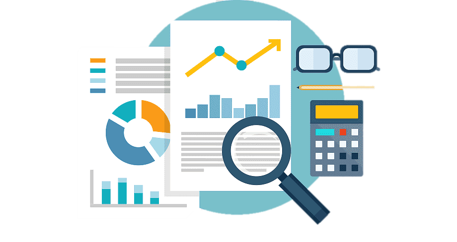
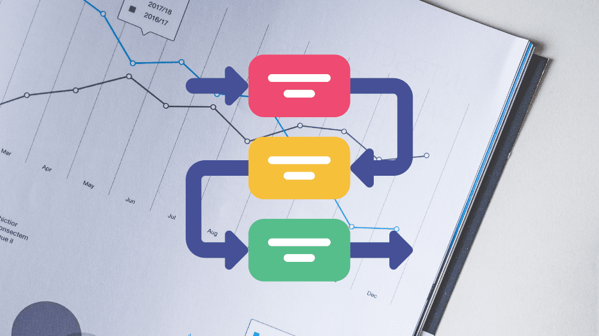
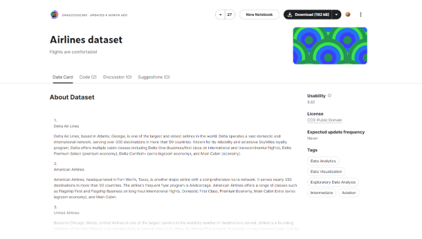
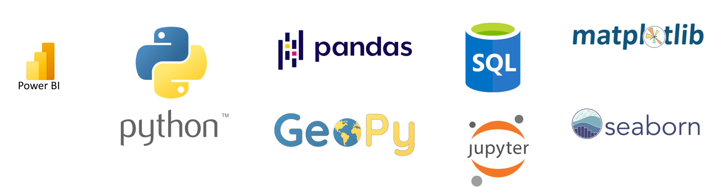

# Airlines Data Analysis
## Descripción del proyecto
El presente proyecto consiste en el análisis de datos de un dataset obtenido mediante la página Kaggle cuya información se compone de datos de aterrizajes de aviones por regiones. 
 

## Alcance del proyecto
Este proyecto tiene el propósito de poder utilizar y mejorar mis habilidades en el lenguaje de programación Python y en la herramienta de reportaje Power BI por medio de análisis de datos al igual que poder emplear mis habilidades en la comunicación escrita, presentación de información y capacidad de análisis. 
 

## Objetivos
#### General
Aplicar técnicas de análisis de datos como limpieza, estandarización, exploración y visualización de datos y empleo de storytelling para la solución de problemas reales y resolución de preguntas de negocio de aerolíneas y stakeholders de la inustria del transporte aéreo.
#### Específicos
- Realizar exploración de datasets y examinar la calidad de los datos.
- Ejecutar procesos de limpieza y estandarización de datos para su análisis.
- Utilizar técnicas de análisis descriptivo y exploratorio para identificar patrones, tendencias y relaciones significativas en los datos.
- Crear visualizaciones efectivas y comprensibles que comuniquen de manera clara y precisa los hallazgos y resultados del análisis.
- Presentar de manera profesional y estructurada el proceso, los resultados y las conclusiones del proyecto, demostrando habilidades de comunicación y documentación técnica.

## Dataset utilizado
El presente dataset consiste en una lista de aterrizajes de aviones por regiones donde se indican datos del peso total desembarcado, la cantidad de vuelos del avión, el tipo de avión y las aerolíneas que los operan o publicitan.

## Herramientas utilizadas
#### Lenguaje de Programación/Gestión de Bases de datos
- Python
- SQL
#### Plataformas/Software
- Jupyter
- Power BI
#### Librerías
- Pandas
- Matplotlib
- Seaborn
- GeoPy

## Resultados
Mediante este proyecto logré profundizar en mi conocimiento sobre las librería Pandas y su uso en la obtención de estadísticas, agrupamiento de datos, visualización rápida y gestión de dataframes. También pude emplear las opciones de visualización de datos y estadísticas ofrecidas por las librerías Matplotlib y Seaborn.
Además aprendí a realizar la transformación y gestión de tablas en Power BI, crear métricas y columnas calculadas, gestionar el modelo de datos y generar dashboards dinámicos de la misma plataforma y mediante scripts en Python.
